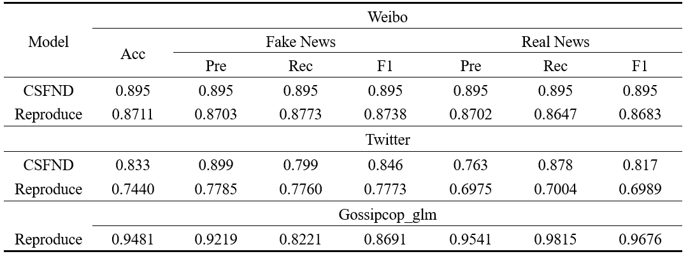
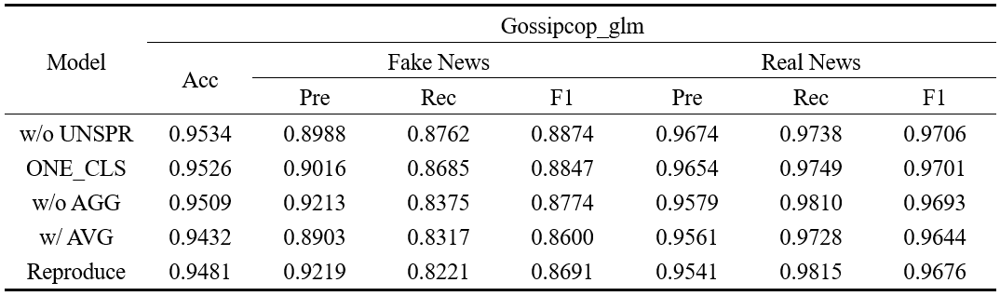

# CSFND
The implement for "Not all fake news is semantically similar: Contextual semantic representation learning for multimodal fake news detection" by **yanjie**@[dominate999](https://github.com/dominate999)
# Quick Start
## Requirements
```
$ conda env create -f myimplement.txt
```
OR
```
$ cd CSFND
$ conda install --yes --file requirements.txt
```
### NOTICE
- python == 3.7.9
- pytroch == pytorch=1.11.0=py3.7_cuda11.3_cudnn8.2.0_0
- transformers==4.11.3

### POTENTIAL ERRORs 
- **Pytorch**
    ```
    conda install pytorch==1.11.0 torchvision==0.12.0 torchaudio==0.11.0 cudatoolkit=11.3 -c pytorch 
    ```
- **transformers**
    ```
    pip install transformers==4.11.3
    ```
- **pandas**
  ```
  pip install pandas
  ```
- **sklearn**
  ```
  pip install scikit-learn
  ```
## Dataset
For the original data, you can download from these links.
- Weibo & Twitter:    [dataset in MRML](https://github.com/plw-study/MRML)
    
- Gossipcop:    [Gossipcop-LLM](https://github.com/junyachen/Data-examples?tab=readme-ov-file)
   - In this mode, we use the ```gossipcop_v3-1_style_based_fake.json```
   - run the **data_process.ipynb**, then you can get the corresponding **trian / test** data

## Pre-trained Model
If you cannot download it online, please download the corresponding pre-trained model through these links.
And then put them in the correct place.
- BERT
  - bert_base_uncased [Link](https://huggingface.co/google-bert/bert-base-uncased)
  - bert_base_chinese [Link](https://huggingface.co/google-bert/bert-base-chinese)
- VGG19 [Link](https://download.pytorch.org/models/vgg19-dcbb9e9d.pth)

## Structure
You need to follow the structure to ensure the project can run normally.
```
├── CSFND
│   └── model
│       ├── bert_base_chinese
│       ├── bert_base_uncased
│       └── vgg19-dcbb9e9d.pth
├── gossipcop_dataset
├── myimplement.txt
├── README.md
├── twitter_dataset
└── weibo_dataset
```

## Running
```
PYTHONUNBUFFERED=1 CUDA_VISIBLE_DEVICES=0 nohup python run.py --dataset=gossipcop_glm > train.log 2>&1 &
```

## Results

### Main Results


### Ablation Study
1. w/o UNSPR
   1. Delete all unsupervised learning modules used
   2. ```--unspr=False --multicls=False --agg=True --avg=False```
2. ONE_CLS
   1. Use a single MLP to classify all the data
   2. ```--unspr=True --multicls=False --agg=True --avg=False```
3. w/o AGG  
   1. Delete this context aggregation module and then only use the context information in your own cluster
   2. ```--unspr=True --multicls=True --agg=False --avg=False```
4. w AVG
   1. Use the average value to replace the context information aggregation module that uses attention
   2. ```--unspr=True --multicls=True --agg=False --avg=True```



```
PYTHONUNBUFFERED=1 CUDA_VISIBLE_DEVICES=0 nohup python run.py --dataset=gossipcop_glm --unspr=False --multicls=False --agg=True --avg=False > gossipcop_glm_train_wo_UNSPR.log 2>&1 &
```
# Reference
```
@article{PENG2024103564,
title = {Not all fake news is semantically similar: Contextual semantic representation learning for multimodal fake news detection},
journal = {Information Processing & Management},
volume = {61},
number = {1},
pages = {103564},
year = {2024},
issn = {0306-4573},
doi = {https://doi.org/10.1016/j.ipm.2023.103564},
url = {https://www.sciencedirect.com/science/article/pii/S0306457323003011},
author = {Liwen Peng and Songlei Jian and Zhigang Kan and Linbo Qiao and Dongsheng Li},
keywords = {Fake news detection, Multimodal learning, Social network, Representation learning, Deep learning}
}
```
